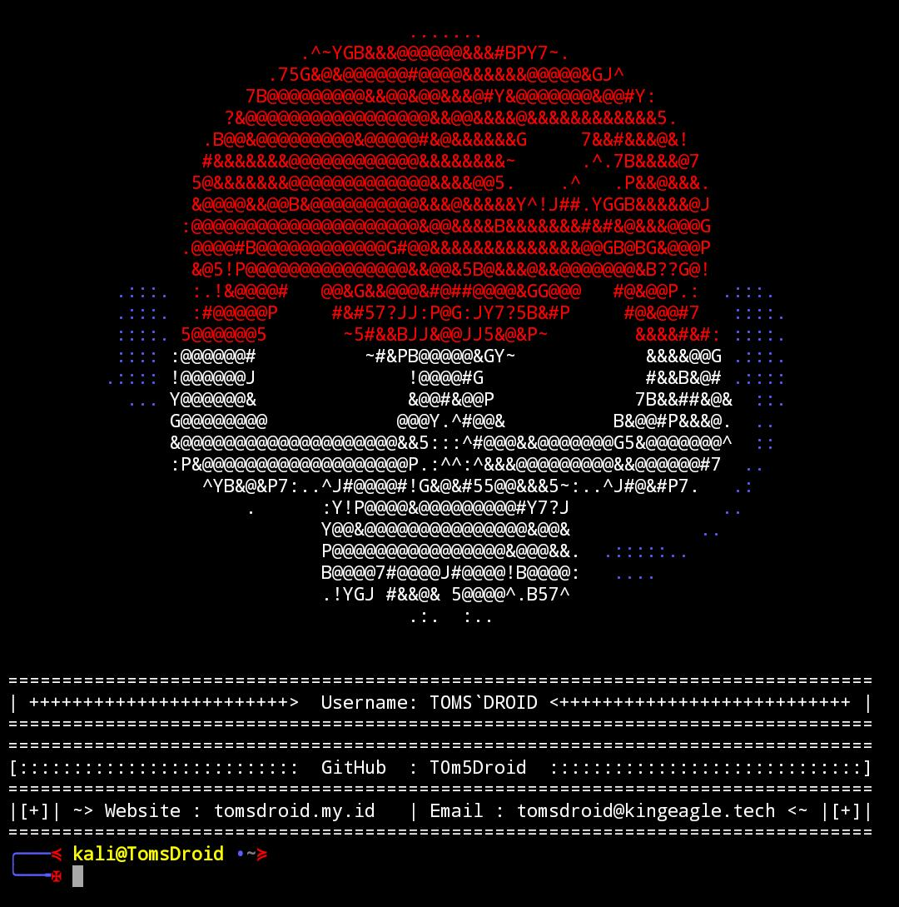

# StyleSCS
Banner command in Terminal displays ASCII character strings in large size on the standard output. This is useful when you want to display a string to be seen when someone logs in using the terminal. The strings are created using the character '#'.

## Screenshots


# How to use StyleSCS in Smartphone Linux Terminal App (TERMUX)?
```terminal
1. pkg update && pkg upgrade
2. termux-setup-storage
3. pkg install python
4. pkg install git
5. git clone https://github.com/SkullCyberSecurity/StyleSCS
6. cd StyleSCS
7. mv scs-file.py $HOME
8. pkg install nano
9. cd ../usr/etc
10. nano bash.bashrc
```
**Note:** _Delete all the contents of the file contained in the bash.bashrc file._

## Change the contents of the bash.bashrc file as below. (Please copy the code)
```
clear
python scs-file.py

PS1='\033[1;34m\]╭───\[\033[1;31m\]≼\[\033[1;33m\] kali@TomsDroid \[\033[1;34m\]>
\[\033[1;34m\]╰──╼\[\033[1;31m\]✠\[\033[1;32m\]'
```

## Greetings [Skull Cyber Security](https://linktr.ee/skullcybersecurity)
